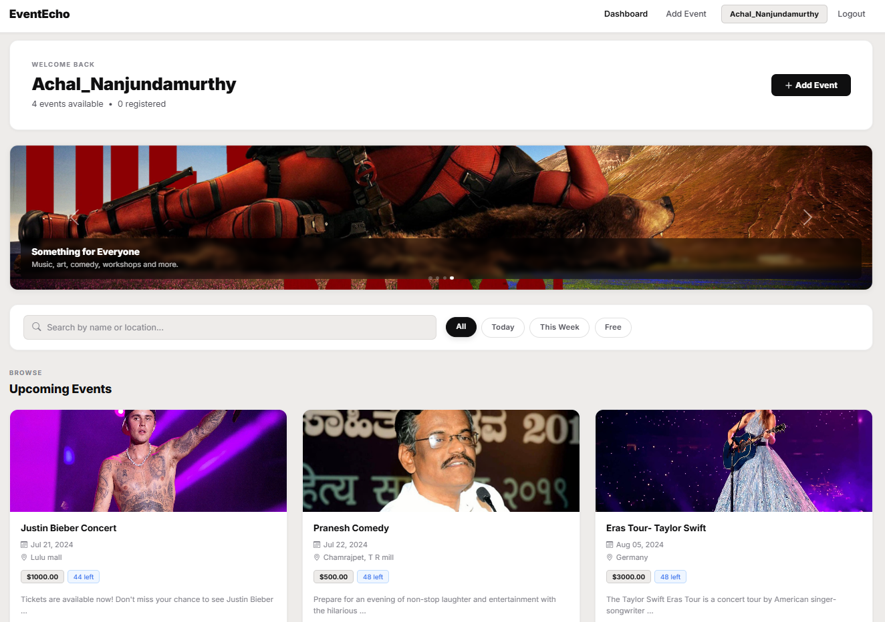
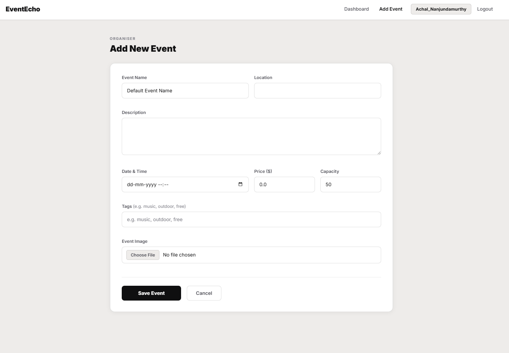
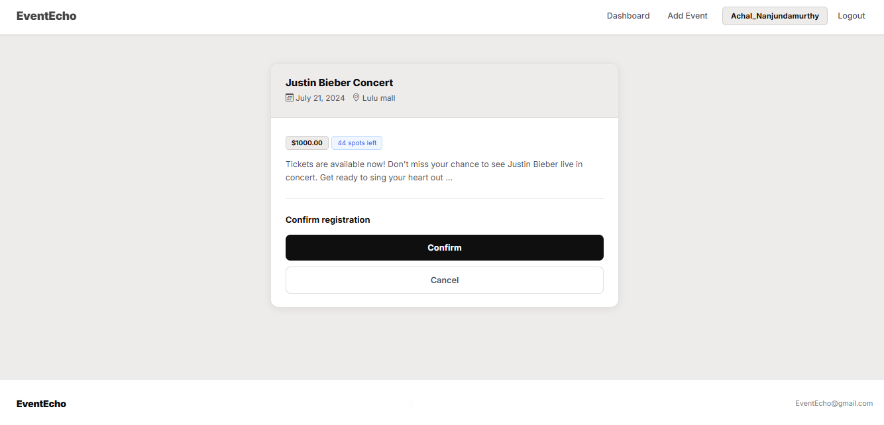
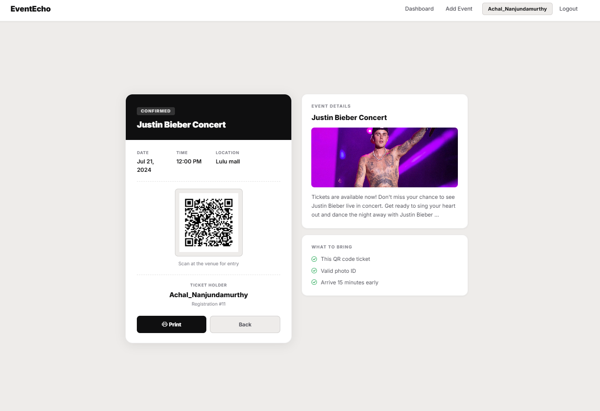

# EventEcho

EventEcho is an event management web app my team and I built during our third year BE at Jyothy Institute of Technology (VTU, Bangalore) as a mini project. It started as a basic Django CRUD app and I kept adding to it over time. It now has QR code ticketing, seat capacity tracking, tag-based event recommendations, and a live search and filter on the dashboard.

The idea was straightforward: a place where users can browse events, register, and get a ticket they can actually print or show at the door. Organisers can post events with a seat limit, price, and tags. When a seat fills up it locks out new registrations automatically.

## Screenshots

### Dashboard

The main page after login. Shows all upcoming events as cards with date, location, price and available spots. There's a search bar at the top that filters results live as you type, and quick filter buttons for Today, This Week, and Free events. Below the event grid is a scrollable performer strip with links to their Wikipedia pages.



### Adding an Event

Any logged-in user can post an event. The form takes a name, location, description, date and time, price, seat capacity, tags (comma separated), and an optional cover image.



### Registering for an Event

When you click register on an event it shows you the details one more time, how many spots are left, and asks you to confirm. If the event is full the button is replaced with a "Fully Booked" message.



### QR Ticket

After confirming, a QR code ticket is generated and saved to your account. The left side has the ticket with date, time, location, QR code and your username. The right side shows the event image and description. You can print it directly from the browser.



## Features

- User signup, login and logout
- Browse upcoming events, search by name or location
- Filter events by today, this week, or free
- Register for events, seat limit enforced automatically
- QR code ticket generated on registration, printable
- Tag-based event recommendations on the dashboard
- Add events with name, location, date, price, capacity, tags and image
- 6 tests covering signup, login, event creation, capacity enforcement, QR generation, and recommendations

## Tech Stack

| Layer | Technology |
| --- | --- |
| Language | Python |
| Framework | Django 6.0 |
| Database | SQLite |
| Recommendations | scikit-learn (TF-IDF + cosine similarity) |
| QR Codes | qrcode, Pillow |
| Frontend | Bootstrap 5 |

## Setup

```bash
git clone https://github.com/achalnm/Event-Echo-Using-Django.git
cd Event-Echo-Using-Django
python -m venv venv
venv\Scripts\activate        # Windows
source venv/bin/activate     # macOS / Linux
pip install -r requirements.txt
python manage.py migrate
python manage.py runserver
```

Open `http://127.0.0.1:8000` in the browser.

For the admin panel run `python manage.py createsuperuser` first, then visit `http://127.0.0.1:8000/admin/`.

## Tests

```bash
python manage.py test
```

6 tests total. They cover user signup and login, creating an event, trying to register when a seat limit is hit, QR code file generation, and the recommendation output.

## Background

This started as a third year mini project submission with just basic event listing and registration. After submitting I kept working on it because there were obvious things missing, like actually knowing how many seats were left, or having something to show at the door. The recommendations feature came from wanting to try out scikit-learn on something concrete rather than a toy dataset.
